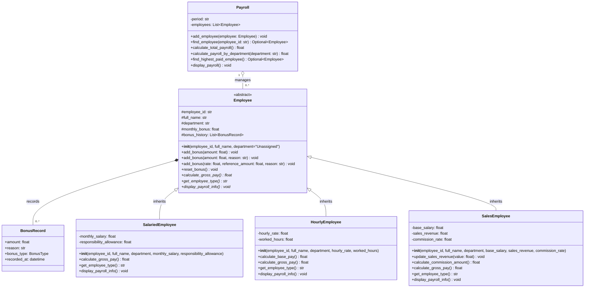

# HỆ THỐNG TÍNH LƯƠNG VÀ THƯỞNG NHÂN SỰ (PYTHON)
**Bài tập Lập trình Hướng đối tượng (OOP)**

---

## 1. Giới thiệu dự án
Dự án được xây dựng nhằm quản lý và tính toán thu nhập hàng tháng cho ba loại hình nhân sự:
- **SalariedEmployee**: Nhân viên hưởng lương cố định theo tháng và phụ cấp trách nhiệm.
- **HourlyEmployee**: Nhân viên hưởng lương theo giờ làm việc thực tế, có chính sách làm thêm giờ (tính hệ số 1.5 khi làm quá 160 giờ/tháng).
- **SalesEmployee**: Nhân viên kinh doanh hưởng lương cơ bản kết hợp tỷ lệ hoa hồng theo doanh số bán hàng.

Hệ thống cung cấp cơ chế ghi nhận khen thưởng linh hoạt thông qua **nạp chồng phương thức (Method Overloading)** và tổng hợp bảng lương tự động thông qua **ghi đè phương thức và đa hình (Method Overriding & Polymorphism)**.

---

## 2. Cấu trúc thư mục dự án

```
PayrollManagementSystem_Python/
├── models/
│   ├── __init__.py
│   ├── bonus_record.py       # Lớp BonusRecord lưu vết lịch sử thưởng có cấu trúc
│   ├── employee.py           # Lớp trừu tượng cơ sở Employee
│   ├── salaried_employee.py  # Lớp SalariedEmployee kế thừa Employee
│   ├── hourly_employee.py    # Lớp HourlyEmployee kế thừa Employee
│   └── sales_employee.py     # Lớp SalesEmployee kế thừa Employee
├── services/
│   ├── __init__.py
│   └── payroll.py            # Lớp dịch vụ Payroll quản lý bảng lương theo kỳ
├── utils/
│   ├── __init__.py
│   └── formatter.py          # Tiện ích định dạng tiền tệ VNĐ và tỷ lệ %
├── tests/
│   ├── __init__.py
│   ├── test_assignment_cases.py   # Kiểm thử các ca dữ liệu chuẩn trong Mục C
│   └── test_boundary_and_errors.py # Kiểm thử hơn 15 ca biên và lỗi trong Mục C.1
├── main.py                   # Ứng dụng chính (Demo tự động + Menu tương tác)
├── run_tests.py              # Script chạy toàn bộ 30 bài kiểm thử tự động
└── README.md                 # Tài liệu hướng dẫn và báo cáo thiết kế
```

---

## 3. Sơ đồ lớp (UML Class Diagram)



---

## 4. Hướng dẫn cài đặt và chạy chương trình

### Yêu cầu môi trường
- Python 3.8+ (khuyên dùng Python 3.9 trở lên).

### 4.1. Chạy chương trình chính (Demo + Menu tương tác)
```bash
py main.py
```
hoặc:
```bash
python main.py
```

### 4.2. Chạy toàn bộ bộ kiểm thử tự động (30 test cases)
```bash
py run_tests.py
```

---

## 5. Kết quả kiểm thử bộ dữ liệu chuẩn (Mục C)

| Mã NV | Họ và tên | Phòng ban | Loại nhân sự | Thành phần thu nhập | Thưởng | Tổng thu nhập |
|---|---|---|---|---|---|---|
| **E001** | Nguyễn Minh An | Đào tạo | Lương cố định | Lương: 15.000.000 đ, Phụ cấp: 2.000.000 đ | 1.000.000 đ (Cố định) | **18.000.000 VNĐ** |
| **E002** | Trần Thu Bình | Hỗ trợ | Theo giờ | 150h × 100.000 đ = 15.000.000 đ | 500.000 đ (Có lý do) | **15.500.000 VNĐ** |
| **E003** | Lê Hoàng Chi | Hỗ trợ | Theo giờ | 160h × 100.000 đ + 10h × 150.000 đ = 17.500.000 đ | 0 đ | **17.500.000 VNĐ** |
| **E004** | Phạm Quốc Dũng | Kinh doanh | Kinh doanh | Lương: 8.000.000 đ + Doanh số: 200M × 5% (10M) | 1.000.000 đ (2% của 50M) | **19.000.000 VNĐ** |

- **Tổng toàn bộ bảng lương kỳ 2026-09**: `18M + 15.5M + 17.5M + 19M = 70.000.000 VNĐ`
- **Tổng lương phòng Hỗ trợ**: `15.5M + 17.5M = 33.000.000 VNĐ`
- **Nhân sự có thu nhập cao nhất**: `Phạm Quốc Dũng (E004)` với `19.000.000 VNĐ`

---

## 6. Giải đáp các câu hỏi thiết kế nâng cao (Mục A.8 & C.1)

### Câu 1: Vì sao `calculateGrossPay()` phù hợp cho ghi đè (overriding), không phải nạp chồng (overloading)?
- **Trả lời**: `calculateGrossPay()` đại diện cho cùng một hành vi nghiệp vụ ("Tính thu nhập trong kỳ của nhân sự") và không yêu cầu thêm tham số đầu vào nào khác nhau. Tuy nhiên, mỗi loại nhân sự có công thức toán học và logic tính toán hoàn toàn khác nhau (`Salaried` dựa vào lương cố định & phụ cấp, `Hourly` dựa vào đơn giá & làm thêm giờ, `Sales` dựa vào hoa hồng doanh số). Ghi đè (overriding) cho phép gọi chung qua con trỏ/tham chiếu lớp cha `Employee` để thực thi đúng công thức của từng lớp con tại thời điểm chạy nhờ cơ chế đa hình động.

### Câu 2: Vì sao `addBonus()` phù hợp cho nạp chồng (overloading)?
- **Trả lời**: `addBonus()` diễn ra trong cùng một lớp `Employee`, phục vụ cùng một mục đích là cộng tiền thưởng vào quỹ thưởng tháng, nhưng hỗ trợ các ngữ cảnh dữ liệu đầu vào khác nhau:
  1. `addBonus(amount)`: Thưởng nhanh một số tiền cố định.
  2. `addBonus(amount, reason)`: Thưởng một số tiền cố định kèm lý do khen thưởng.
  3. `addBonus(rate, referenceAmount, reason)`: Thưởng theo % một giá trị tham chiếu (ví dụ % doanh thu vượt chỉ tiêu) kèm lý do.
  Nạp chồng giúp tạo giao diện hàm trực quan, người dùng không cần đặt các tên hàm rườm rà như `addBonusAmount`, `addBonusRate`.

### Câu 3: Payroll nên lưu đối tượng, tham chiếu hay con trỏ như thế nào để tránh mất hành vi lớp dẫn xuất?
- **Trả lời**:
  - Trong các ngôn ngữ như C++, nếu lưu theo kiểu giá trị trực tiếp (`std::vector<Employee>`), sẽ xảy ra hiện tượng **Object Slicing (Cắt lát đối tượng)** — toàn bộ dữ liệu và bảng ảo vtable của lớp con sẽ bị cắt bỏ, chỉ giữ lại phần lớp cha, làm mất tính đa hình.
  - Do đó, phải lưu trữ dưới dạng **con trỏ hoặc tham chiếu** (C++ dùng `std::vector<std::shared_ptr<Employee>>` hoặc `std::vector<std::unique_ptr<Employee>>`).
  - Trong Python và Java, mọi biến đối tượng bản chất đều là **tham chiếu (object references)**, do đó `List[Employee]` trong Python tự động duy trì tính đa hình nguyên vẹn mà không bị cắt lát đối tượng.

### Câu 4: Lớp cơ sở Employee nên là lớp cụ thể hay lớp trừu tượng? Giải thích lựa chọn.
- **Trả lời**: `Employee` **bắt buộc phải là lớp trừu tượng (Abstract Class)** vì:
  1. *Ngăn ngừa khởi tạo sai nghiệp vụ*: Trong thực tế không tồn tại một "nhân viên chung chung" không có quy chế tính lương cụ thể.
  2. *Bắt buộc chuẩn giao tiếp (Contract)*: Ép buộc tất cả các lớp con phát triển sau này phải tự cài đặt `calculateGrossPay()` và `getEmployeeType()`.
  3. *Tối ưu hóa đa hình*: Cho phép lớp `Payroll` gọi `calculateGrossPay()` một cách an toàn mà không cần biết chi tiết lớp con.

### Câu 5: Nếu nhân viên kinh doanh cũng được trả theo giờ, kế thừa đơn có còn phù hợp không?
- **Trả lời**:
  - Kế thừa đơn sẽ bộc lộ hạn chế vì một nhân viên không thể vừa kế thừa trực tiếp từ `HourlyEmployee` vừa kế thừa từ `SalesEmployee` trong các ngôn ngữ đơn kế thừa như Java, C# (hoặc gặp vấn đề Diamond Problem trong C++/Python).
  - **Giải pháp tối ưu**: Chuyển từ quan hệ thừa kế kế thừa (Inheritance) sang quan hệ kết hợp thành phần (**Composition**) và áp dụng **Strategy Pattern**: tách riêng `PaymentStrategy` (chính sách trả lương theo giờ, lương cứng, hoa hồng) và gắn (`inject`) vào đối tượng `Employee`.

### Câu 6: Có nên đặt `calculateTotalPayroll()` là thành viên static không? Vì sao?
- **Trả lời**: **KHÔNG NÊN** đặt là `static` vì:
  - `calculateTotalPayroll()` phụ thuộc trực tiếp vào trạng thái nội tại (`instance state`) của đối tượng `Payroll` cụ thể (kỳ lương nào, danh sách nhân viên trong kỳ đó gồm những ai).
  - Nếu đặt là static, phương thức sẽ không thể truy cập danh sách nhân viên `self._employees` của từng kỳ lương riêng biệt, gây khó khăn cho việc quản lý song song nhiều kỳ lương hoặc nhiều chi nhánh công ty.

### Câu 7: Phiên bản `addBonus()` nào được chọn trong từng lời gọi và vì sao?
- **Trả lời**:
  - Trình thông dịch / trình biên dịch dựa vào **số lượng tham số (arities)** và **kiểu dữ liệu (types)** của các đối số truyền vào tại lời gọi hàm để ánh xạ và chọn đúng phiên bản tương ứng.

### Câu 8: Việc lựa chọn phương thức nạp chồng diễn ra ở thời điểm biên dịch hay chạy?
- **Trả lời**:
  - Trong các ngôn ngữ tĩnh (C++, Java, C#), việc lựa chọn phương thức nạp chồng diễn ra ở **thời điểm biên dịch (Compile-time / Early Binding)** dựa trên kiểu khai báo tĩnh của tham số.
  - Trong Python (ngôn ngữ động), việc phân phối lời gọi hàm diễn ra ở **thời điểm chạy (Runtime)** thông qua kiểm tra số lượng và kiểu của `args`.

### Câu 9: Việc lựa chọn `calculateGrossPay()` của lớp dẫn xuất diễn ra như thế nào?
- **Trả lời**:
  - Diễn ra ở **thời điểm chạy (Runtime / Late Binding / Dynamic Dispatch)**.
  - Khi `emp.calculateGrossPay()` được gọi từ `Payroll`, máy ảo/trình thông dịch sẽ tra cứu bảng phương thức ảo (**Virtual Method Table - vtable** hoặc `__dict__`/MRO trong Python) của đối tượng thực tế tại vùng nhớ heap để thực thi phương thức của lớp con tương ứng (`SalariedEmployee`, `HourlyEmployee` hoặc `SalesEmployee`).

### Câu 10: Nếu thay danh sách kiểu `Employee` bằng nhiều danh sách riêng cho từng loại, thiết kế thay đổi ra sao?
- **Trả lời**:
  - Nếu thay bằng 3 danh sách riêng (`salaried_list`, `hourly_list`, `sales_list`):
    1. *Vi phạm nguyên lý Đóng/Mở (Open/Closed Principle - OCP)*: Mỗi khi doanh nghiệp có thêm loại nhân sự mới (ví dụ: `ContractEmployee`), `Payroll` buộc phải tạo thêm một danh sách mới và sửa đổi toàn bộ các hàm tính tổng.
    2. *Trùng lặp mã nguồn (DRY)*: Phải lặp lại các vòng lặp tính toán cho từng danh sách.
    3. *Mất tính đa hình*: Mất đi lợi ích cốt lõi của OOP trong việc xử lý đồng nhất các đối tượng thông qua giao diện chung của lớp cha.

### Câu 11: Khi thêm loại `ContractEmployee`, phần mã nào phải sửa và phần nào không nên phải sửa?
- **Trả lời**:
  - **Phần PHẢI viết mới**:
    - Tạo lớp `ContractEmployee` kế thừa từ `Employee`.
    - Cài đặt constructor và ghi đè phương thức `calculateGrossPay()`, `getEmployeeType()`, `displayPayrollInfo()`.
  - **Phần KHÔNG ĐƯỢC PHÉP phải sửa**:
    - Lớp `Payroll` giữ nguyên 100% (không cần sửa `calculateTotalPayroll`, `findHighestPaidEmployee`, `displayPayroll`...).
    - Lớp cơ sở `Employee` và 3 lớp nhân sự cũ (`SalariedEmployee`, `HourlyEmployee`, `SalesEmployee`) giữ nguyên hoàn toàn.
  - Đây chính là sự tuân thủ hoàn hảo nguyên lý **Open/Closed Principle (Mở để mở rộng, đóng để sửa đổi)**.
